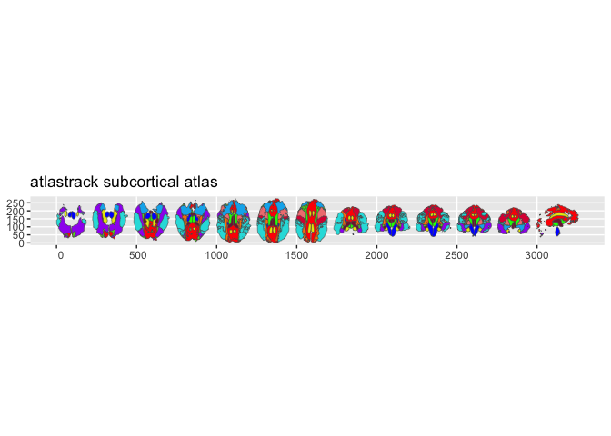

<!-- README.md is generated from README.Rmd. Please edit that file -->

# ggsegAtlasTrack

<!-- badges: start -->

[](https://github.com/ggsegverse/ggsegAtlasTrack/actions/workflows/R-CMD-check.yaml)
[](https://ggsegverse.r-universe.dev/ggsegAtlasTrack)
<!-- badges: end -->

AtlasTrack Fiber Tract Atlas for the ggsegverse Ecosystem.

## Installation

``` r
# From r-universe
install.packages("ggsegAtlastrack", repos = "https://ggsegverse.r-universe.dev")

# From GitHub
# install.packages("remotes")
remotes::install_github("ggsegverse/ggsegAtlasTrack")
```

## Atlases

### atlastrack

AtlasTrack probabilistic white matter fiber tract atlas with 35 tracts.

``` r
library(ggsegAtlastrack)
plot(atlastrack())
```


\## Data source

[NITRC](https://www.nitrc.org/projects/atlastrack) (converted from
MATLAB sparse format).

- **Date obtained**: 2026-03-28

- **Date obtained**: 2026-03-28
