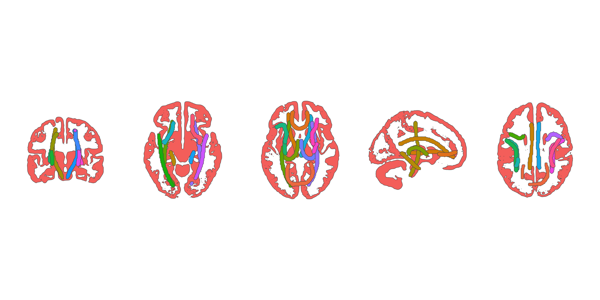

<!-- README.md is generated from README.qmd. Please edit that file -->

# ggsegAtlasTrack

<!-- badges: start -->

[](https://github.com/ggsegverse/ggsegAtlasTrack/actions/workflows/R-CMD-check.yaml)
[](https://ggseg.r-universe.dev/ggsegAtlasTrack)
<!-- badges: end -->

AtlasTrack probabilistic white matter fiber tract atlas for the ggseg
ecosystem.

## Installation

We recommend installing the ggseg-atlases through the ggseg
[r-universe](https://ggseg.r-universe.dev/ui#builds):

``` r
options(repos = c(
  ggseg = "https://ggseg.r-universe.dev",
  CRAN = "https://cloud.r-project.org"
))

install.packages("ggsegAtlasTrack")
```

You can install this package from [GitHub](https://github.com/) with:

``` r
# install.packages("pak")
pak::pak("ggsegverse/ggsegAtlasTrack")
```

## AtlasTrack

``` r
library(ggseg.formats)
library(ggsegAtlastrack)

plot(atlastrack())
```



## Data source

Data obtained from [NITRC](https://www.nitrc.org/projects/atlastrack).
